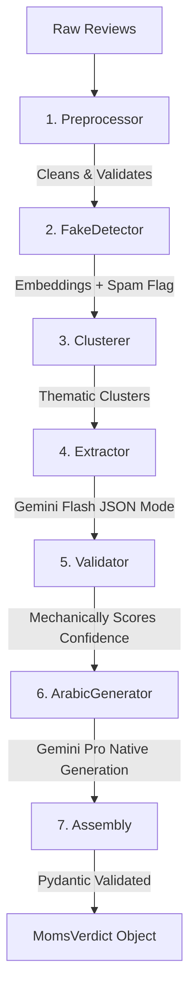

# 👩‍🍼 Moms Verdict AI Pipeline

An end-to-end, deterministic AI pipeline that synthesizes raw e-commerce reviews into structured, grounded, and bilingual (English/Arabic) product verdicts.

This project was built to solve the "lost in the middle" hallucination problem and the "stiff translation" problem commonly found in naive LLM review summarizers.

## 🌟 Key Features

- **Strict Data Contracts:** Built entirely on Pydantic `v2` schemas to ensure predictable, structured data flows between all pipeline stages.
- **Zero-Hallucination Grounding:** The LLM is forced to provide a verbatim quote from the source text for every Pro and Con it extracts. If it can't find a quote, the claim is dropped.
- **Deterministic Fake Review Detection:** Uses local, multilingual Sentence Transformers (`paraphrase-multilingual-MiniLM-L12-v2`) and $O(n^2)$ cosine similarity to mechanically flag spam clusters without relying on expensive LLM calls.
- **Native Arabic Generation:** Instead of translating English output (which often feels stiff and foreign to native speakers), the pipeline feeds structured, language-agnostic facts (Pros, Cons, Sentiment) to Gemini Pro to generate a native, culturally-aware Arabic verdict from scratch.
- **Gradio UI:** A clean, split-pane UI for reviewing pipeline results.

## 🏗️ Architecture

The system is decoupled into 7 distinct stages:



## 🚀 Setup & Execution (Google Colab)

Due to the size of the ML dependencies (`sentence-transformers`, `torch`), this project is optimized to run in a cloud environment like Google Colab to preserve local disk space.

1. **Upload the Project** to your Google Drive or clone the repository into a Colab notebook.
2. **Install Dependencies:**
   ```bash
   pip install google-generativeai sentence-transformers scikit-learn pydantic gradio python-dotenv rich
   ```
3. **Configure Environment:**
   Set your Google Gemini API key in the notebook environment:
   ```python
   import os
   os.environ["GOOGLE_API_KEY"] = "your_gemini_api_key_here"
   ```
4. **Generate Synthetic Test Data:**
   Run the data generator to create 4 distinct edge-case datasets (Genuine, Sparse, Spam, Mixed):
   ```bash
   python data/generate_reviews.py
   ```
5. **Run the UI:**
   Launch the Gradio interface. Colab will generate a public `*.gradio.live` link you can use to interact with the system.
   ```bash
   python app.py
   ```

## 🧪 Evals

The evaluation framework lives in `evals/`. It uses 12 strict assertions against the generated synthetic datasets to verify that the mechanical safeguards (Fake Detector, Insufficient Data gates) are functioning properly.

```bash
python evals/eval_runner.py
```

See [EVALS.md](EVALS.md) for the methodology and latest test run results.

## ⚖️ Tradeoffs

Please see [TRADEOFFS.md](TRADEOFFS.md) for a detailed breakdown of the intentional engineering and architectural tradeoffs made during the development of this prototype.
